# QDesktop-Editor桌面（私有子网增强版）部署指南与快速入门手册

- [ ] 快速图文安装教程请点击： [[图文教程-QDesktop-Editor桌面通过AWS控制台的部署手册与快速使用入门](./图文教程-QDesktop-Editor桌面通过AWS控制台的部署手册与快速使用入门 .md)]

- [ ] QDesktop-editor Cloudformation 一键部署脚本：[[qdesktop-editor-privatesubnet-fullfeatures-enhanced-20250918.yaml](./qdesktop-editor-privatesubnet-fullfeatures-enhanced-20250918.yaml)]


## 概述

QDesktop-Editor 私有子网增强版（`qdesktop-editor-privatesubnet-fullfeatures-enhanced-v3.yaml`）是一个专为企业级私有网络环境设计的完整开发环境解决方案。该模板在保留所有原始功能的基础上，专门针对私有子网部署进行了优化，提供了安全、功能完整的云端IDE体验。

### 核心特性

- **🔒 私有子网部署**：完全部署在私有子网中，确保网络安全
- **🛠️ 全功能开发环境**：包含所有主流开发工具和语言支持
- **🔐 企业级安全**：集成AWS Secrets Manager、IAM角色和加密存储
- **📊 完整监控**：CloudWatch Agent集成，提供全面的系统监控
- **🚀 自动化部署**：基于SSM文档的完全自动化配置

## 架构概览

**在您现有VPC的Private subnet（私有子网）中开启EC2，完成 QDesktop-Editor桌面的部署，并通过私有IP地址进行“内网IP”的直接访问**。

### 网络架构

QDesktop-Editor私有子网架构图

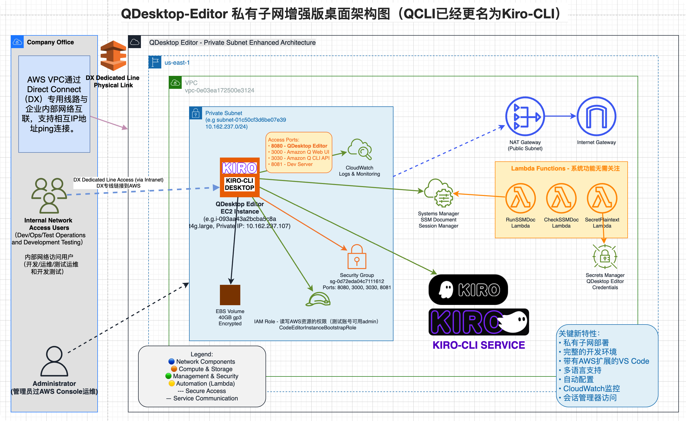


## 部署前准备

### 必需资源

1. **VPC环境**
   - 已存在的VPC
   - 私有子网（用于部署EC2实例）
   - 适当的路由表配置（NAT Gateway或NAT Instance用于外网访问）

2. **网络访问**
   - Bastion主机或VPN连接（用于访问私有子网中的IDE）
   - 或者配置AWS Systems Manager Session Manager

3. **权限要求**
   - CloudFormation部署权限
   - EC2、IAM、Secrets Manager、SSM相关权限

### 网络规划

确保以下网络连通性：
- 私有子网可以通过NAT Gateway访问互联网（用于软件包下载）
- 管理员可以通过Bastion主机或VPN访问私有子网
- 安全组配置允许必要的端口访问

## 快速部署

### 1. 下载模板

```bash
# 下载最新的v3模板
wget https://your-bucket/qdesktop-editor-privatesubnet-fullfeatures-enhanced-v3.yaml
```

### 2. 部署命令

```bash
aws cloudformation create-stack \
  --stack-name qdesktop-editor-private-enhanced \
  --template-body file://qdesktop-editor-privatesubnet-fullfeatures-enhanced-v3.yaml \
  --parameters \
    ParameterKey=VpcId,ParameterValue=vpc-xxxxxxxxx \
    ParameterKey=PrivateSubnetId,ParameterValue=subnet-xxxxxxxxx \
    ParameterKey=VpcCidr,ParameterValue=10.0.0.0/16 \
    ParameterKey=InstanceType,ParameterValue=t4g.large \
    ParameterKey=InstanceVolumeSize,ParameterValue=40 \
  --capabilities CAPABILITY_IAM \
  --region us-east-1
```

### 3. 监控部署进度

```bash
# 查看堆栈状态
aws cloudformation describe-stacks \
  --stack-name qdesktop-editor-private-enhanced \
  --query 'Stacks[0].StackStatus'

# 查看部署日志
aws logs describe-log-groups --log-group-name-prefix "/aws/ssm/"
```

## 配置参数详解

### 实例配置

| 参数 | 默认值 | 描述 | 推荐设置 |
|------|--------|------|----------|
| `InstanceName` | QDesktopEditor-Privatesubnet-Enhanced | EC2实例名称 | 根据环境自定义 |
| `InstanceType` | t4g.medium | EC2实例类型 | 开发环境：t4g.large<br>生产环境：t4g.xlarge |
| `InstanceVolumeSize` | 40 | 磁盘大小(GB) | 最小40GB，推荐80GB+ |
| `InstanceOperatingSystem` | AmazonLinux-2023 | 操作系统 | AmazonLinux-2023（推荐）<br>Ubuntu-22/Ubuntu-24 |

### 网络配置

| 参数 | 描述 | 示例值 |
|------|------|--------|
| `VpcId` | VPC ID | vpc-0e03ea172500e3124 |
| `PrivateSubnetId` | 私有子网ID | subnet-01c50cf3d6be07e39 |
| `VpcCidr` | VPC CIDR范围 | 10.0.0.0/16 |

### 应用配置（用缺省配置，第一次用建议忽略）

| 参数 | 默认值 | 描述 |
|------|--------|------|
| `CodeEditorUser` | participant | IDE用户名 |
| `HomeFolder` | /workshop | 工作目录 |
| `DevServerPort` | 8081 | 开发服务器端口 |
| `DevServerBasePath` | app | 应用基础路径 |

### 资源配置（可选 - 第一次用建议忽略）

| 参数 | 描述 | 用途 |
|------|------|------|
| `RepoUrl` | Git仓库URL | 自动克隆代码仓库 |
| `AssetZipS3Path` | S3资源文件路径 | 预置项目文件 |
| `BranchZipS3Path` | S3分支文件路径 | 创建多个Git分支 |
| `FolderZipS3Path` | S3文件夹路径 | 创建多个项目文件夹 |

## 访问方式

### 通过私有IP地址进行“内网IP”的直接访问 

如果您在本地网络已经配置了DX专线（或VPN）连接到 AWS VPC，可以直接通过浏览器访问：

```
http://PRIVATE_IP:8080/?folder=/workshop&tkn=PASSWORD
```

[截图：QDesktop-Editor登录界面]

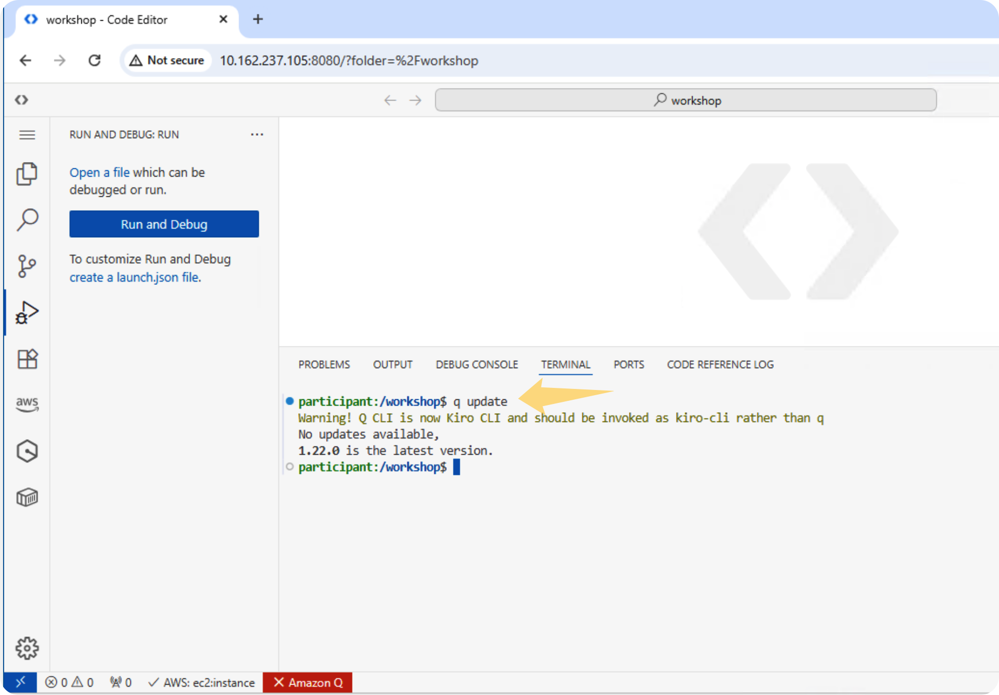


## 获取访问凭据

### 1、登录AWS控制台，从CloudFormation输出直接看

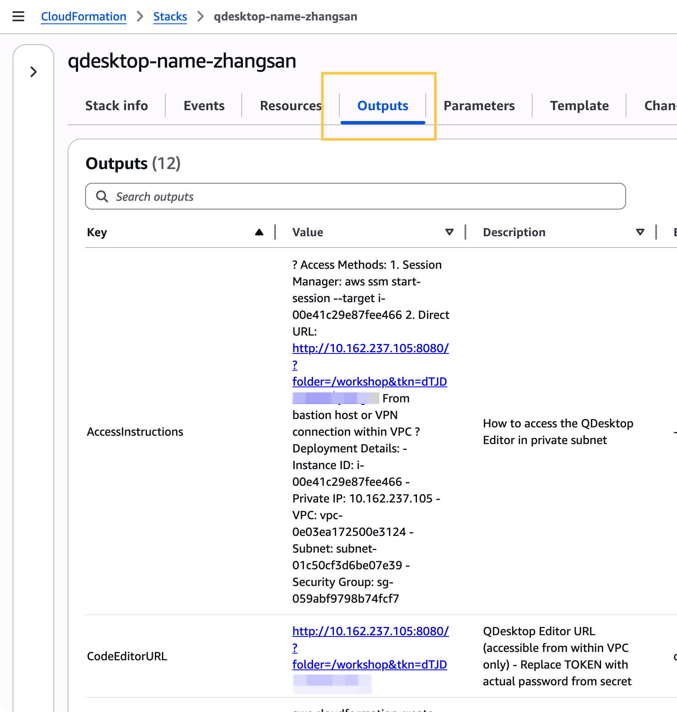


### 2、从CloudFormation输出获取

```bash
# 获取访问URL
aws cloudformation describe-stacks \
  --stack-name qdesktop-editor-private-enhanced \
  --query 'Stacks[0].Outputs[?OutputKey==`CodeEditorURL`].OutputValue' \
  --output text

# 获取私有IP
aws cloudformation describe-stacks \
  --stack-name qdesktop-editor-private-enhanced \
  --query 'Stacks[0].Outputs[?OutputKey==`PrivateIP`].OutputValue' \
  --output text
```

### 3、从Secrets Manager获取密码

```bash
# 获取Secret ARN
SECRET_ARN=$(aws cloudformation describe-stacks \
  --stack-name qdesktop-editor-private-enhanced \
  --query 'Stacks[0].Outputs[?OutputKey==`SecretArn`].OutputValue' \
  --output text)

# 获取密码
aws secretsmanager get-secret-value \
  --secret-id $SECRET_ARN \
  --query 'SecretString' \
  --output text | jq -r '.password'
```


## 预装开发环境

### 系统工具

- **AWS CLI** - AWS命令行工具
- **Amazon Q CLI** - Q命令行界面 **（第一次开机，建议进行icli升级操作，命令行：q update）**
- **Git** - 版本控制
- **uv** - Python包管理器
- **CDK** - AWS云开发工具包
- **CloudWatch Agent** - 系统监控

### 开发工具

✅ **已预装的开发工具：**

- **Node.js & npm** - JavaScript/TypeScript开发
- **Python 3.11** - Python开发（AL2023）/ Python 3.12（Ubuntu）
- **Java** - Amazon Corretto OpenJDK 8, 17, 21
- **Go** - Go语言开发环境
- **Rust** - Rust开发工具链
- **Docker** - 容器化开发
- **.NET 8.0** - .NET开发框架
- **Terraform** - 基础设施即代码

### VS Code扩展

✅ **已安装的扩展：**

- **AWS Toolkit** - AWS服务集成
- **Amazon Q Developer** - AI编程助手
- **Live Server** - 实时预览服务器
- **Auto Run Command** - 自动执行命令
- **Python Extension Pack** - Python开发支持
- **Java Extension Pack** - Java开发支持
- **Docker Extension** - Docker支持


## 高级配置

### 自定义开发环境

#### 1. 预置代码仓库

```yaml
# 在contentspec.yaml中配置
parameters:
  - templateParameter: RepoUrl
    defaultValue: 'https://github.com/your-org/your-project.git'
  - templateParameter: HomeFolder
    defaultValue: /workspace/project
```

#### 2. 预置项目资源

```yaml
# 配置S3资源文件
parameters:
  - templateParameter: AssetZipS3Path
    defaultValue: 'your-bucket/assets/project-files.zip'
```

#### 3. 多分支开发环境

```yaml
# 配置多分支环境
parameters:
  - templateParameter: BranchZipS3Path
    defaultValue: 'your-bucket/branches/all-branches.zip'
```

### 网络安全配置

#### 安全组规则

模板自动创建的安全组包含以下规则：

```yaml
SecurityGroupIngress:
  - Port 8080: QDesktop Editor访问
  - Port 8081: 开发服务器（可配置）
```

#### 访问控制

- 所有入站流量仅限VPC内部访问
- 出站流量允许访问互联网（用于软件包下载）
- 通过IAM角色控制AWS服务访问权限

## 监控与日志

### CloudWatch监控

[插入示例：CloudWatch监控面板]

#### 系统指标

- CPU使用率
- 内存使用率  
- 磁盘使用率
- 网络流量

#### 应用日志

```bash
# 查看部署日志
aws logs describe-log-groups --log-group-name-prefix "/aws/ssm/"

# 查看特定日志流
aws logs get-log-events \
  --log-group-name "/aws/ssm/qdesktop-editor-document" \
  --log-stream-name "instance-id/step-name"
```

### 健康检查

```bash
# 检查服务状态
curl http://PRIVATE_IP:8080/healthz

# 检查系统服务
systemctl status code-editor@participant
```


## 故障排除

### 常见问题

#### 1. 无法访问IDE界面

**症状：** 浏览器无法连接到IDE

**解决方案：**
```bash
# 检查实例状态
aws ec2 describe-instances --instance-ids i-xxxxxxxxx

# 检查安全组配置
aws ec2 describe-security-groups --group-ids sg-xxxxxxxxx

# 检查服务状态
aws ssm start-session --target i-xxxxxxxxx
sudo systemctl status code-editor@participant
```

#### 2. 部署失败

**症状：** CloudFormation堆栈创建失败

**解决方案：**
```bash
# 查看堆栈事件
aws cloudformation describe-stack-events \
  --stack-name qdesktop-editor-private-enhanced

# 查看SSM执行日志
aws ssm describe-command-invocations \
  --instance-id i-xxxxxxxxx \
  --details
```

#### 3. 网络连接问题

**症状：** 实例无法访问互联网

**检查项：**
- NAT Gateway配置
- 路由表设置
- 安全组出站规则
- 网络ACL配置

### 日志分析

#### SSM文档执行日志

```bash
# 查看所有SSM命令
aws ssm list-commands

# 查看特定命令详情
aws ssm get-command-invocation \
  --command-id "command-id" \
  --instance-id "i-xxxxxxxxx"
```

#### 应用程序日志

```bash
# 连接到实例查看日志
aws ssm start-session --target i-xxxxxxxxx

# 查看QDesktop Editor日志
sudo journalctl -u code-editor@participant -f

# 查看系统日志
sudo tail -f /var/log/messages
```

## 性能优化

### 实例规格建议

| 用途 | 实例类型 | vCPU | 内存 | 存储 |
|------|----------|------|------|------|
| 轻量开发 | t4g.medium | 2 | 4GB | 40GB |
| 标准开发 | t4g.large | 2 | 8GB | 80GB |
| 重度开发 | t4g.xlarge | 4 | 16GB | 120GB |
| 团队共享 | c6g.2xlarge | 8 | 16GB | 200GB |

### 存储优化

```yaml
# 推荐的存储配置
BlockDeviceMappings:
  - DeviceName: /dev/xvda
    Ebs:
      VolumeSize: 80  # 根据需要调整
      VolumeType: gp3  # 高性能SSD
      Iops: 3000      # 可选：自定义IOPS
      Throughput: 125 # 可选：自定义吞吐量
```

## 安全最佳实践

### 1. 网络安全

- ✅ 部署在私有子网
- ✅ 最小权限安全组规则
- ✅ VPC内部访问控制
- ✅ 加密存储卷

### 2. 身份认证

- ✅ AWS Secrets Manager管理密码
- ✅ IAM角色最小权限原则
- ✅ Session Manager安全访问

### 3. 数据保护

- ✅ EBS卷加密
- ✅ 传输中数据加密
- ✅ 访问日志记录

## 扩展与定制

### 添加自定义软件

在SSM文档中添加安装步骤：

```yaml
- name: InstallCustomSoftware
  action: aws:runShellScript
  inputs:
    runCommand:
      - '#!/bin/bash'
      - # 添加自定义安装命令
      - echo "Installing custom software..."
```

### 自定义VS Code配置

```json
{
  "workbench.colorTheme": "Default Dark+",
  "editor.fontSize": 14,
  "terminal.integrated.fontSize": 12,
  "aws.telemetry": false,
  "extensions.autoUpdate": false
}
```

### 环境变量配置

```bash
# 在用户配置文件中添加
echo 'export CUSTOM_VAR=value' >> /home/participant/.bashrc
echo 'export AWS_REGION=us-east-1' >> /home/participant/.bashrc
```

## 成本优化

### 1. 实例调度

```bash
# 可以使用Lambda函数自动启停实例
# 工作时间启动，非工作时间停止
aws ec2 stop-instances --instance-ids i-xxxxxxxxx
aws ec2 start-instances --instance-ids i-xxxxxxxxx
```

### 2. 存储优化

- 使用gp3卷类型获得更好的性价比
- 定期清理不需要的文件
- 考虑使用EFS用于共享存储

### 3. 网络成本

- 使用VPC Endpoints减少NAT Gateway费用
- 优化数据传输路径


## 部署示例

### 完整部署脚本（命令行方式）

```bash
#!/bin/bash

# 设置变量
STACK_NAME="qdesktop-editor-private-enhanced"
VPC_ID="vpc-0e03ea172500e3124"
SUBNET_ID="subnet-01c50cf3d6be07e39"
VPC_CIDR="10.0.0.0/16"

# 部署CloudFormation堆栈
aws cloudformation create-stack \
  --stack-name $STACK_NAME \
  --template-body file://qdesktop-editor-privatesubnet-fullfeatures-enhanced-v3.yaml \
  --parameters \
    ParameterKey=VpcId,ParameterValue=$VPC_ID \
    ParameterKey=PrivateSubnetId,ParameterValue=$SUBNET_ID \
    ParameterKey=VpcCidr,ParameterValue=$VPC_CIDR \
    ParameterKey=InstanceType,ParameterValue=t4g.large \
    ParameterKey=InstanceVolumeSize,ParameterValue=80 \
    ParameterKey=CodeEditorUser,ParameterValue=developer \
    ParameterKey=HomeFolder,ParameterValue=/workspace \
  --capabilities CAPABILITY_IAM \
  --region us-east-1

# 等待部署完成
echo "等待堆栈部署完成..."
aws cloudformation wait stack-create-complete --stack-name $STACK_NAME

# 获取访问信息
echo "部署完成！获取访问信息："
aws cloudformation describe-stacks \
  --stack-name $STACK_NAME \
  --query 'Stacks[0].Outputs[?OutputKey==`AccessInstructions`].OutputValue' \
  --output text
```

## 参考资源

### 官方文档

- [AWS CloudFormation用户指南](https://docs.aws.amazon.com/cloudformation/)
- [Amazon EC2用户指南](https://docs.aws.amazon.com/ec2/)
- [AWS Systems Manager用户指南](https://docs.aws.amazon.com/systems-manager/)
- [Amazon Q Developer文档](https://docs.aws.amazon.com/amazonq/)

### 相关模板

- 基础版QDesktop Editor模板
- 公有子网部署模板
- 多用户共享模板

### 支持与反馈

如遇到问题或需要技术支持，请：

1. 查看CloudWatch日志进行初步诊断
2. 检查AWS文档和最佳实践
3. 联系技术支持团队

---

**版本信息：** v3.0.0 - 私有子网增强版  
**最后更新：** 2025年12月18日  
**兼容性：** AWS CloudFormation, Amazon Linux 2023, Ubuntu 22/24


# QDesktop-Editor桌面，通过AWS控制台的部署手册（图文指南）与快速使用入门

## 1、了解您的AWS账号下的部署环境，确认要部署的目标vpc和私有子网

1）建议用管理员IAM权限账号登录AWS控制台，然后选择您已经创建了私有子网的AWS Region（建议考虑 us-east-1 美东1 region）。

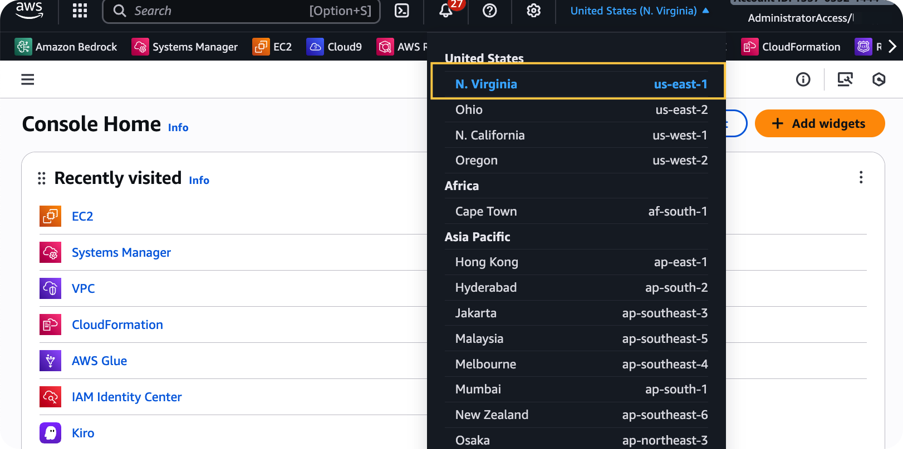


2）然后打开VPC服务，点击《VPC dashboard》，查看你要部署的VPC，从里面找到合适的 private-subnet 私有子网（如下图）。

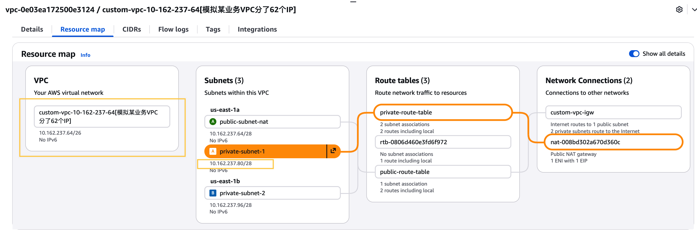

这个示例你能看到：

1. 创建的VPC为 CIDRs  ”10.162.237.64/26“ 的网段（可以理解为：业务部门申请了私有网段并且已经接入企业内网 - 通过DX专线互联）； 
2. QDesktop 可以被部署在“10.162.237.80/28”  - 名字为“private-subnet-1”的私有子网；
3. “private-subnet-1”这个私有子网，已经配置了一个NAT网关 - 这意味私有子网里面的EC2可以从公网下载并更新开发组件包（非常重要！）；


## 2、通过CloudFormation服务进行图形化部署QDesktop

1）打开cloudformation服务，点击“CloudFormation -> Stacks -> Create stack”，点击《Choose file》后选择《qdesktop-editor-privatesubnet-fullfeatures-enhanced-20250918.yaml》，如下图：

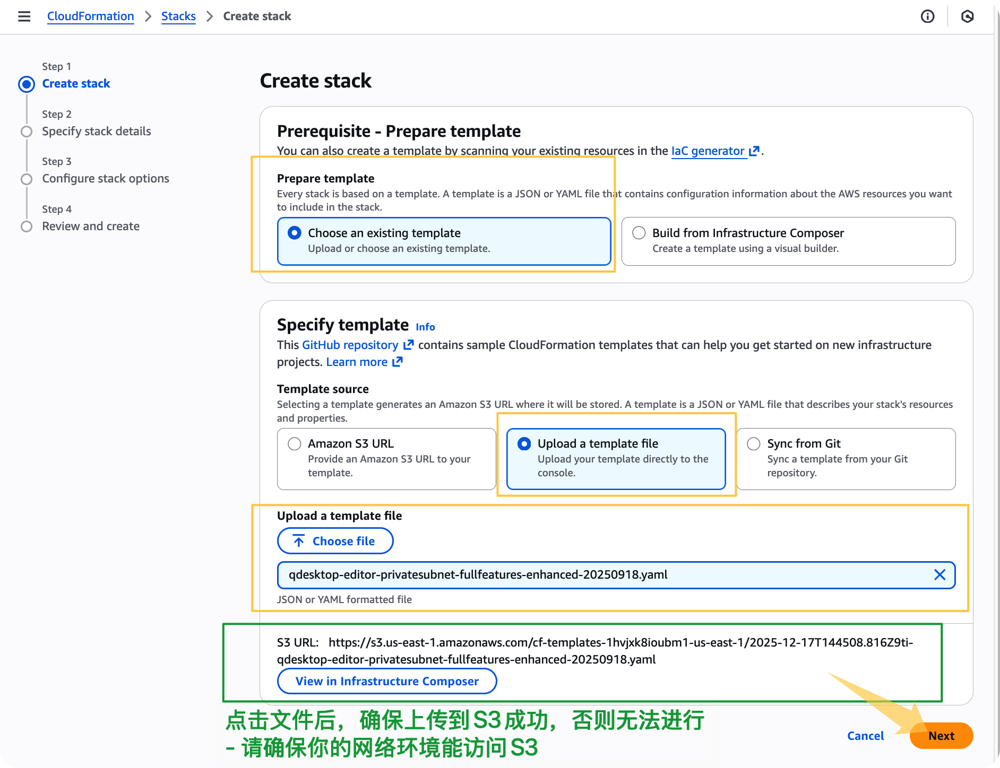

2）Specify stack details 的关键属性：

1. Stack name & Instance name 建议用员工变化或姓名命名，如：qdesktop-username-**zhangsan**
2. Network Configuration： VPC ID & Private Subnet ID 指定了QDesktop部署的目标VPC和子网，选择与上面《VPC dashboard》 一致的内容；VPC CIDR 指的是安全组的访问来源范围，不清楚如何配置就用缺省参数；
3. 其他参数：可以保留缺省参数，无需变更；

示例截图如下：

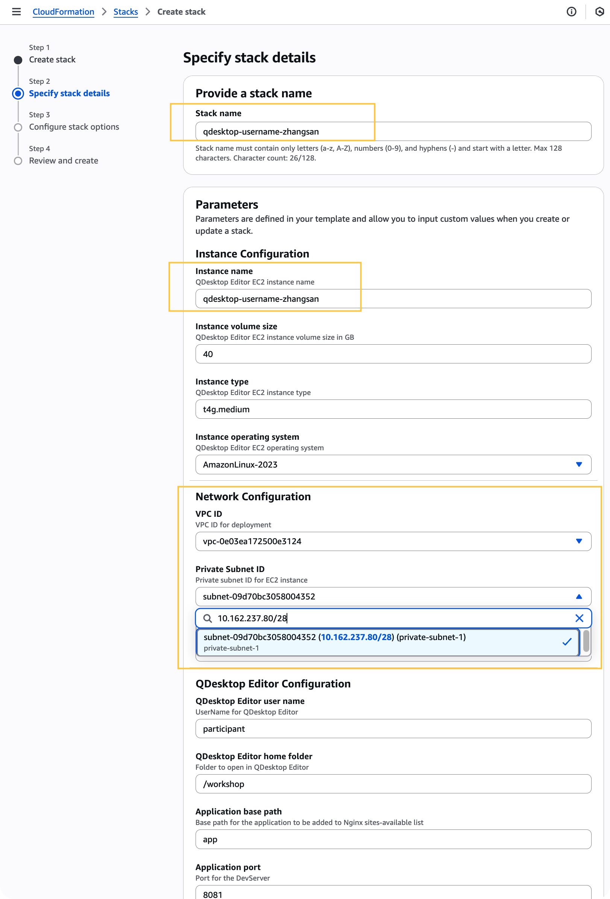

3）点击下一步后，然后圈选“I acknowledge that AWS CloudFormation might create IAM resources.”后点击下一步；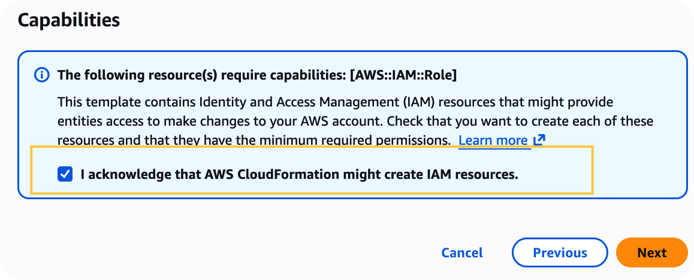

4）点击Submit提交，然后等待部署状态从“ CREATE_IN_PROGRESS” 变为“CREATE_COMPLETE”，整个过程需要10-20分钟；

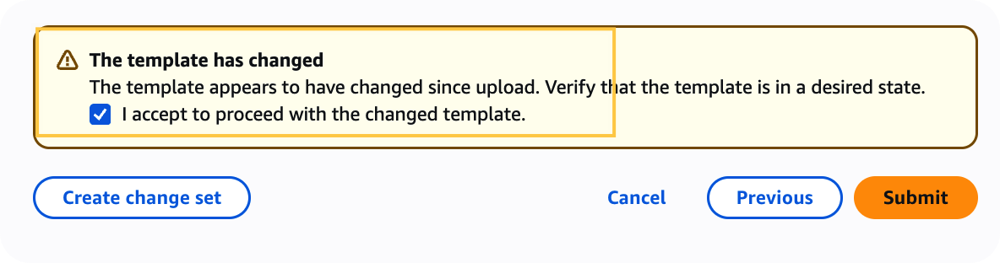

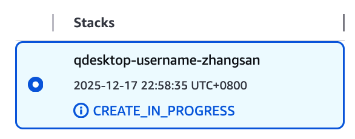

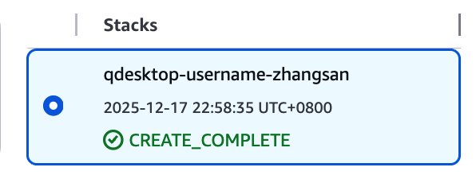

4）点击"Outputs" 分页栏，获取 “InstanceId”  = i-0e77c0893f7aa2470 ，并copy记录下来；

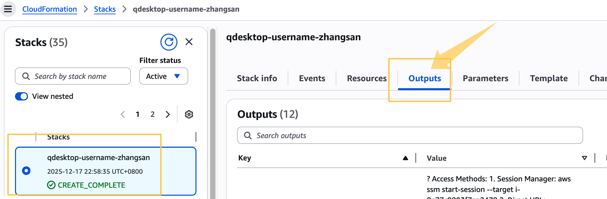

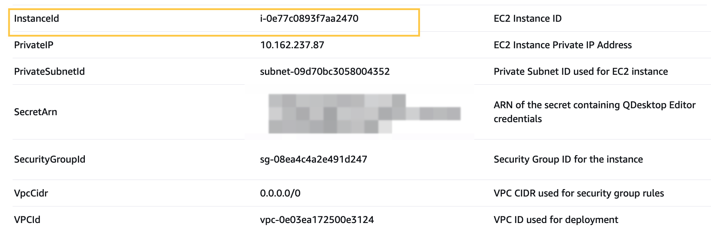


## 3、对QDesktop-Editor桌面进行权限配置

在AWS控制台中打开 EC2 服务，然后查找  “InstanceId”  = i-0e77c0893f7aa2470 ，然后鼠标右键 Security -> Modify IAM role.

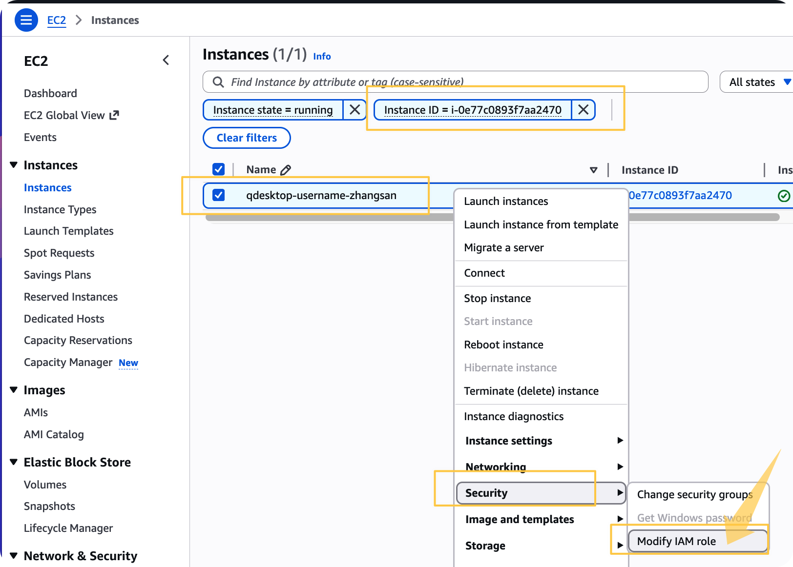

如果您使用的AWS账号为测试环境，**由于您暂时不确认QDesktop会调用哪些AWS服务，建议可以临时 给Admin的IAM权限。** 等待任务范围确认后，更换为权限更小的IAM Role。 操作如下：

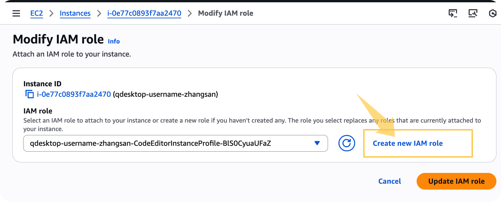

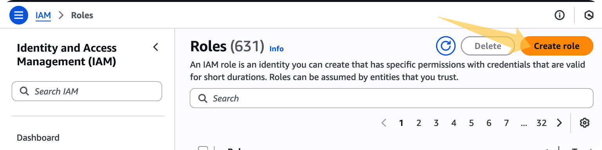

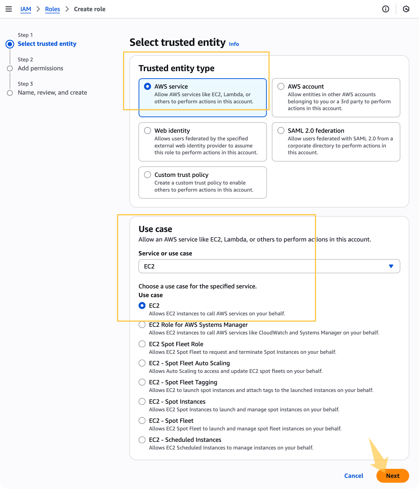

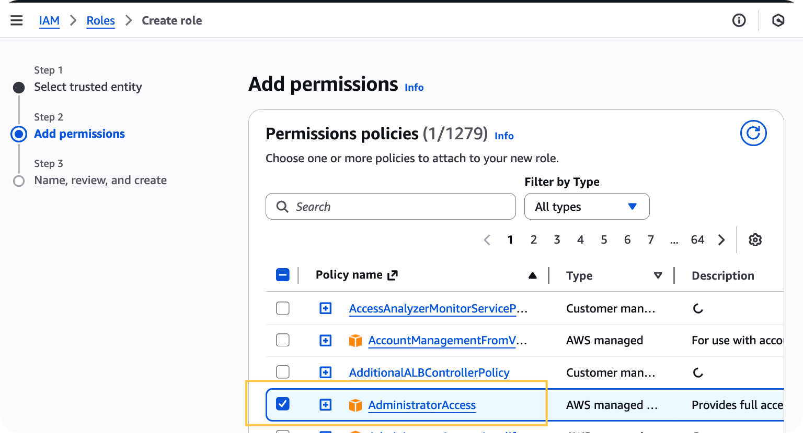

QDesktop-EC2-Admin

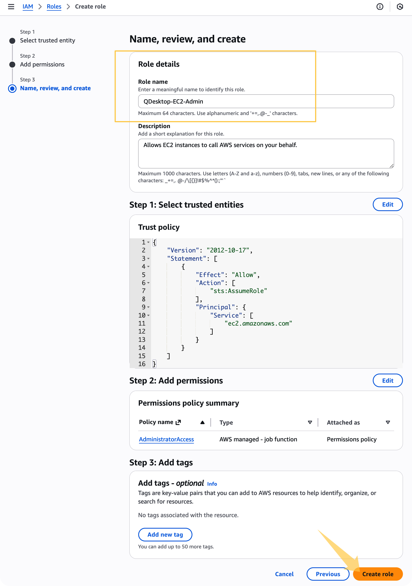

创建QDesktop-EC2-Admin Role成功后，返回刚才的EC2页面，然后点击刷新后，就可以选择《QDesktop-EC2-Admin》，然后点击“Update IAM role”；

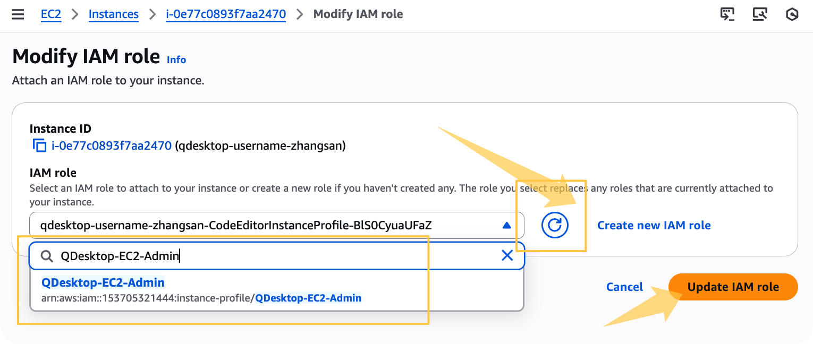


## 4、登录 QDesktop-Editor桌面 ，完成初始化后正常使用

打开 CloudFormation -> Stacks -> qdesktop-username-zhangsan，然后打开Outputs分页栏：

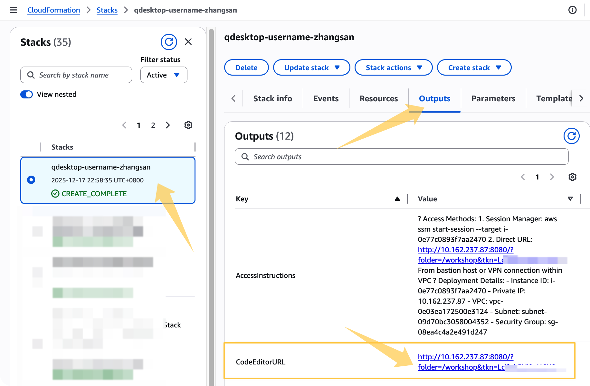

点击CodeEditorURL后，就可以获得私有IP地址的登录网址**（请分发给最终用户这个地址使用即可。由于是内网IP，EC2关机后重启内网IP不变化 - 可以自由关机降低成本）**。

此时，您在本地网络已经配置了DX专线（或VPN）连接到 AWS VPC，输入您的浏览器后 - 直接通过浏览器访问：

```
http://PRIVATE_IP:8080/?folder=/workshop&tkn=PASSWORD
```

[QDesktop-Editor登录界面]


建议操作：

1. 第一次开机，运行以下命令更新 Amazon Q CLI  --> Kiro-CLI (功能一样，升级后名字改了)：

   ```bash
   $ q update
   ```
1. 运行以下命令登录 Amazon Q CLI：

   ```bash
   $ q login
   ```
1. 运行以下命令验证 Amazon Q CLI 是否正常工作：

   ```bash
   $ q chat
   ```

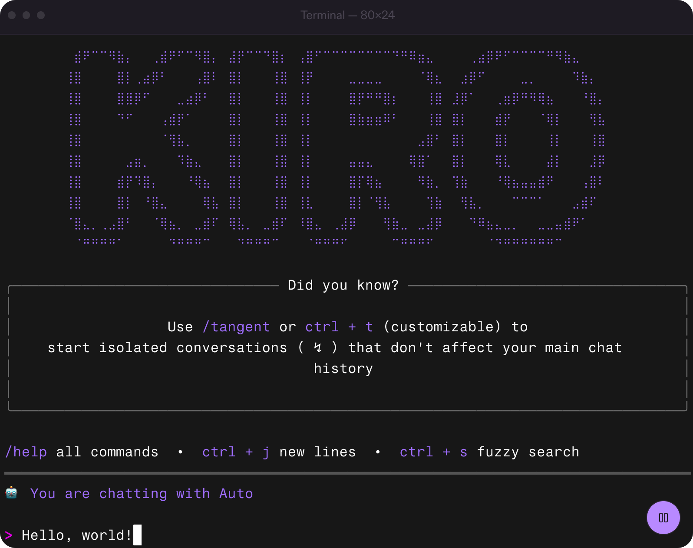


更多教程：因为当前QDeskop的EC2已经配置了 IAM Role Admin 的权限，对当前测试AWS账户有完整的访问权限。意味着QCLI可以创建/销毁AWS资源，您可以通过这些 《[基础实验](https://catalog.us-east-1.prod.workshops.aws/workshops/aa2f7dda-789c-4602-aebb-adbd2071db85/zh-CN/basic-lab)》来快速掌握QCLI基本功能和常见使用场景，以及如何使用Q CLI完成AWS操作中的基本问题。


## 5、结束


